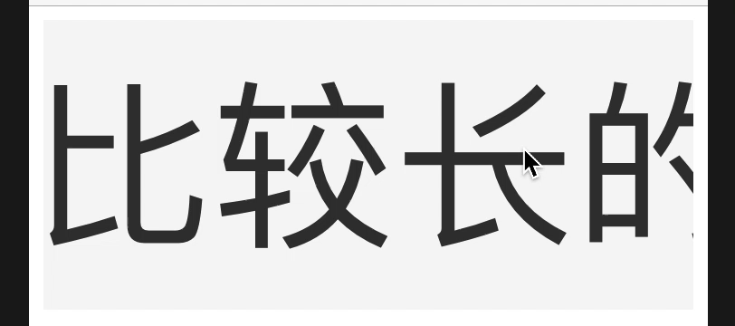
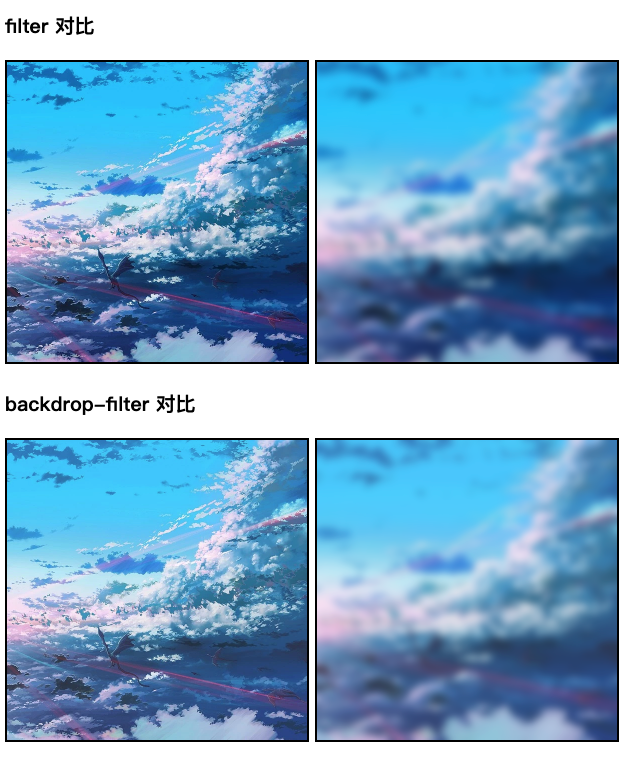

# H5 小技巧

## 1、移动端滚动条隐藏

[代码](./scrollbarTest.html)

[DEMO](https://apollo-zz.github.io/h5-skills/scrollbarTest.html)

## 2、高斯模糊毛玻璃效果

[代码](./filter-and-backdrop-filter.html)

[DEMO](https://apollo-zz.github.io/h5-skills/filter-and-backdrop-filter.html)

[在线示例](https://codepen.io/Apollozz/pen/OJLxyjw)